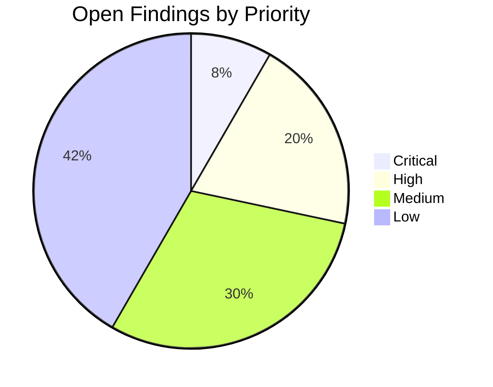

# Demplot Security Metrics Dashboard

## Key Performance Indicators

### Vulnerability Management
```promql
# Critical vulnerability aging
sum by (system) (
  vulnerabilities{severity="critical"} * on (system) group_left 
  (max_over_time(vulnerability_age_days[7d]))
)
```

### Incident Response
| Metric | PromQL | Target |
|--------|--------|--------|
| MTTR | `avg_over_time(mttr_hours[4w])` | <2h |
| Detection Rate | `detected_incidents/total_incidents` | >98% |
| Containment | `contained_within_30m/total_incidents` | >95% |

## Compliance Monitoring

### Control Coverage
```sql
-- PostgreSQL query for compliance posture
SELECT 
  framework,
  COUNT(*) as total_controls,
  SUM(CASE WHEN implemented THEN 1 ELSE 0 END) as implemented,
  (SUM(CASE WHEN implemented THEN 1 ELSE 0 END) * 100.0 / COUNT(*)) as percentage
FROM security_controls
GROUP BY framework;
```

### Audit Findings


## Dashboard Views

### Executive Overview
- **Security Posture Score**: 0-100 scale
- **Top Risks**: 5 highest rated risks
- **Investment Allocation**: Security spend breakdown

### Operational View
```yaml
# Sample Grafana configuration
panels:
  - title: "Patch Compliance"
    type: "stat"
    targets:
      - expr: "100 - (unpatched_systems/total_systems * 100)"
        format: "percent"
    thresholds: [90, 95]
```

### Technical Deep Dive
- Real-time SIEM alerts
- Vulnerability heatmap
- Configuration drift analysis

## Data Integration

### Sources
| Data Type | Integration Method | Update Frequency |
|-----------|--------------------|------------------|
| Vulnerabilities | API to Tenable | Hourly |
| Logs | Elasticsearch | Real-time |
| Assets | CMDB Sync | Daily |
| Threats | SIEM API | Real-time |

### Transformation Pipeline
```python
# Sample data processing
def calculate_risk_score(vulns, configs, threats):
    base_score = (vulns * 0.4) + (configs * 0.3) + (threats * 0.3)
    return adjust_for_business_impact(base_score)
```

## Alerting Rules
```yaml
groups:
- name: security-metrics
  rules:
  - alert: CriticalControlFailure
    expr: |
      security_controls{severity="critical",status!="passed"} > 0
    for: 15m
    labels:
      severity: critical
    annotations:
      summary: "Critical control {{ $labels.control }} failed"