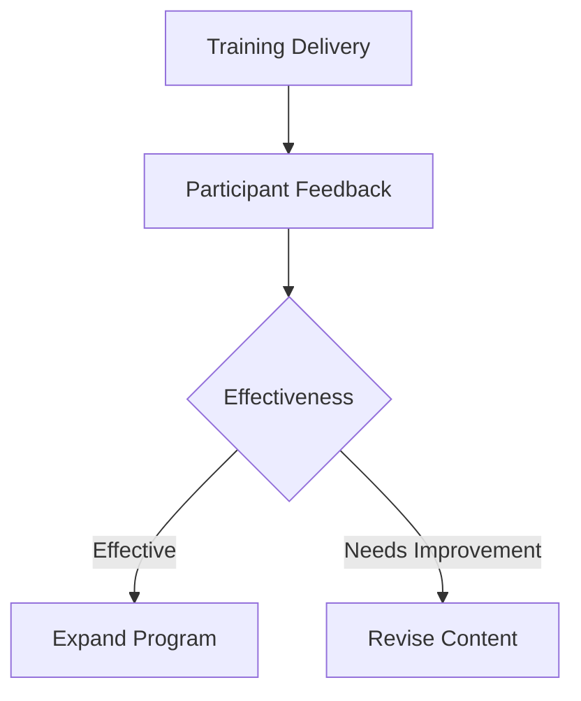

# Demplot Security Awareness Training Program

## Core Training Modules

### 1. Phishing Awareness
```markdown
- Identification techniques:
  * Suspicious sender addresses
  * Urgent/Threatening language
  * Mismatched URLs
  * Unexpected attachments
- Reporting procedures:
  * Use of "Report Phish" button
  * Incident response workflow
  * False positive handling
```

### 2. Data Protection
```yaml
data_classification:
  public:
    handling: "May be shared externally"
    storage: "Any company system"
  confidential:
    handling: "Internal use only"
    storage: "Encrypted storage"
  restricted:
    handling: "Need-to-know basis"
    storage: "Secure enclaves"
```

### 3. Access Security
```javascript
// Password policy validation
function validatePassword(password) {
  const minLength = 12;
  const hasUpper = /[A-Z]/.test(password);
  const hasLower = /[a-z]/.test(password);
  const hasNumber = /\d/.test(password);
  const hasSpecial = /[!@#$%^&*]/.test(password);
  
  return password.length >= minLength && 
         hasUpper && hasLower && 
         hasNumber && hasSpecial;
}
```

## Role-Based Training

### Developers
```markdown
- Secure coding practices
- Dependency vulnerability management
- Secrets management
- Code review security checklist
```

### IT Operations
```markdown
- Infrastructure hardening
- Log management
- Patch management
- Backup verification
```

### Executives
```markdown
- Risk management frameworks
- Compliance requirements
- Incident response protocols
- Third-party risk management
```

## Delivery & Evaluation

### Training Methods
| Format | Frequency | Duration | Completion Goal |
|--------|-----------|----------|-----------------|
| E-learning | Annual | 1 hour | 100% completion |
| Phishing Tests | Quarterly | N/A | <5% click rate |
| Workshops | Biannual | 2 hours | 90% attendance |

### Metrics Dashboard
```sql
SELECT 
  department,
  AVG(quiz_score) as avg_score,
  COUNT(CASE WHEN phish_reported THEN 1 END) as reports,
  COUNT(CASE WHEN phish_clicked THEN 1 END) as clicks
FROM security_training
GROUP BY department;
```

## Continuous Improvement

### Feedback Cycle


### Program Updates
1. **Quarterly**: Refresh threat examples
2. **Biannual**: Update training content
3. **Annual**: Full program review